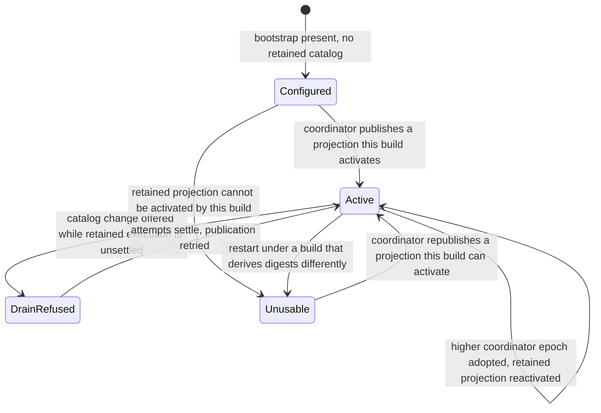

# S5b ADR: worker interoperability, execution environments and deferred fleet mechanisms

Status: accepted design. A classification record over the S5b design inventory, not a full contract
freeze. It enrolls no host and changes no deployed configuration.

## Scenario and decision

The closeout plan lists more environment, credential, compatibility and recovery machinery than the
campaign needs, and building all of it first would delay the use case that proves the system:
Huyang-scale backlog batches dispatched across homelab and omarchy-pc. The plan is therefore read
as a design inventory, and each capability here is classified as **implement now** (part of the
thin vertical slice), **seam only** (keep the boundary clean, build no mechanism) or **deferred**
(record the intent and the trigger that would justify revisiting).

Exactly one capability in this area is implemented now: reliable worker and catalog
interoperability across homelab and omarchy-pc. Everything else is a seam or a deferral, with its
trigger in the closing classification.

## Implement now: worker and catalog interoperability

### Identity

Two hosts interoperate reliably only when both agree on which identities are authoritative. A
worker's identity is its enrollment tuple — worker ID, allowed coordinator ID, credential reference
and transport principal — never its hostname, its address or the connection it arrived on. A
dropped SSH connection, a reconnect and a worker restart are the same worker; only enrollment
creates or replaces one. That is what lets omarchy-pc and homelab differ in addressing, uptime and
transport reliability without differing in orchestration behaviour.

The worker epoch fences custody: an epoch change invalidates outstanding offers and claims and
requires explicit custody recovery when durable execution state is retained, and it is never proof
that a running effect stopped. The coordinator epoch is a monotonic floor per worker — a frame at a
lower epoch is refused, and adopting a higher one reactivates the retained catalog under the new
epoch rather than mutating a running runtime in place.

A catalog revision names coordinator intent; the projection digest names bytes. Conflating them
produced the failure below, so the slice keeps both in the protocol and in every error message,
with release and build identity alongside, because digest derivation is a property of the build
that derives it.

### Catalog activation

Activation means constructing a complete worker runtime from a projection and only then publishing
its durable pointer. The candidate runtime is validated first and the retained catalog file is
rewritten only after it succeeds, so a projection this build cannot turn into a runtime never
becomes persistent worker state. Boot-time load, republication and coordinator-epoch adoption share
that one serialized path; three activation paths would be three chances for two hosts to diverge.

The drain guard is part of activation, not a courtesy: a catalog change is refused while the
worker's journal owns an unsettled attempt, and a worker epoch change with retained state is
refused pending explicit custody recovery.

### A retained catalog this build cannot activate

This is the interoperability failure the fleet actually hit: a release derived catalog digests
differently from the release that wrote the retained catalog, the worker exited at startup with a
digest mismatch, and it stayed down until an operator moved `catalog.json` aside on that host.
Custody was preserved, but recovery needed a human on every host.

An unusable retained catalog must degrade the worker instead of stranding it. The worker starts,
activates no runtime, records why, refuses every execution frame while no catalog is usable, and
waits for republication. It never deletes or rewrites the unactivatable projection, and it still
remembers it, so a replacement cannot skip the drain guard — which reads the durable journal
directly when no runtime exists. Only the expected-revision fence is skipped, because a digest this
build never derives cannot be the revision the coordinator names; coordinator principal, epoch
floor, signature, replay identity and drain still apply.

The slice adds the coordinator half: a worker with no usable catalog is a placement exclusion with
a named, operator-visible reason, not a worker that merely looks stale. Read-only journal
inspection reports how many attempts the journal owns and how many are dispatched, so an updater
decides whether a restart would interrupt execution instead of assuming a quiet worker.

### Protocol and capability negotiation strictly needed

The protocol already carries a version on every envelope, an `unsupported-version` error code and a
negotiation record of supported versions, named capabilities and a maximum message size. The slice
needs three things from it: version intersection at session open, so an incompatible worker is
excluded from placement with a reason instead of being given work it will later reject; named
capability strings for optional message types, currently artifact streaming and journal inspection,
so a newer coordinator never sends a frame an older worker refuses mid-assignment; and an agreed
maximum message size, because artifact transport limits differ per host and silent truncation is
worse than refusal. It builds no compatibility matrix beyond the current and previous version, no
per-attempt feature flags and no mixed-version rollout orchestration.

## Seam only: `ExecutionEnvironmentSpec` and the two backends

The boundary is named now; no mechanism is built now. `ExecutionEnvironmentSpec` is reserved as the
name of a task-level declaration of how an attempt executes — platform, backend selector, pinned
tool material, mounts, network policy and teardown. It does not exist yet. The existing
`domain.ExecutionEnvironment{Type, Scope, Ref}` keeps its current meaning, fields and wire name: it
declares the project workspace a workflow wants prepared, and the spec neither renames, replaces
nor absorbs it. When the spec arrives it references the workspace declaration as one of its inputs;
the workspace declaration never references the spec.

The distinction the seam preserves is between an **attested host profile** — a named, versioned
baseline already present on a worker, whose content the steward observes but does not own — and an
**ephemeral execution environment** — a content-addressed base plus an attempt-local writable layer
that the steward constructs and destroys. Ephemeral is intended to become the portable default and
the host profile the explicit fast path. There is no fallback between them in either direction, now
or later: a missing profile or a failed realization fails preparation with an actionable reason
instead of quietly running somewhere else.

Today every attempt uses the converged host toolchain, an implicit host profile. The one seam
obligation the slice carries is to make that profile named rather than assumed: the assignment
record keeps the worker's advertised capabilities and release identity as the description of the
environment the attempt ran in, so a later spec can select a profile explicitly without rewriting
assignment history. Nothing else is built — no artifact-backed realization, no writable-layer
lifecycle, no attestation record, no cache-sharing rules, no reclamation policy. Steward
environment ownership, whenever it arrives, never authorizes installing missing host packages: a
missing baseline is reported before execution and repaired through omarchy-setup or UpKeeper.

Trigger to revisit: the first workflow that must pin a toolchain the fleet baseline does not carry
— a custom Huyang build run as an execution-local MCP server is the expected first case — or the
first disagreement between the homelab and omarchy-pc toolchains that changes a result.

## Deferred capabilities

**Comprehensive credential and egress management.** `CredentialGrant` and a full `NetworkPolicy`
are deferred. The recorded intent is short-lived capability grants naming purpose, scopes, target,
expiry and revocation identity, with egress denied unless declared and destinations named by
logical service rather than address. One rule holds now, because it is cheap and cannot be
retrofitted: secret bytes never enter prompts, context probes, artifacts, receipts, logs or
diagnosis bundles — only credential references travel, as the existing `credentialRef` does.
Trigger: a workload needing authority beyond the host-managed credential reference, or egress
beyond the provider and Git endpoints the hosts already reach.

**Rolling-version machinery.** `WorkerDrain` as a first-class record and mixed-version rollout
orchestration are deferred; the recorded intent is that drain stops new assignments and lets active
attempts settle at a safe boundary without losing an attempt or an effect. Until then a worker is
upgraded between batches, using the existing draining flag, the backlog-acceptance switch and
read-only journal inspection. Trigger: an upgrade that cannot wait for a quiet batch boundary.

**Disaster recovery.** `BackupManifest`, `StateSchemaVersion` migration design and
restore-from-clean-state qualification are deferred; forward-only migrations that older builds
refuse to open and coherent stopped-snapshot backups stay. The recorded intent is a versioned
manifest covering coordinator metadata, artifact manifests and lineage, decision requests and
responses, and effect intents and receipts, with restore verifying identities and digests and
reconciling workers and external effects before admission reopens. Trigger: state loss, a migration
that cannot be forward-fixed, or durable state that resubmitting work cannot recreate.

Deferral is not permission to build something that must later be undone. Nothing in the slice may
assume a long-lived credential, unbounded egress, an in-place schema downgrade, or a worker-local
copy as the only durable copy of anything.

## Alternatives and failures

Freezing all eleven records in this area now was rejected: most describe mechanisms no planned
workload exercises, and a frozen contract that nothing implements ages into fiction while still
costing an ADR to change. Building ephemeral environments before two-host dispatch was rejected for
the same reason — the first batches use the converged fleet toolchain, so realization would add
per-attempt cost and a containment dependency normandy lacks, buying portability nothing asks for
yet.

Deleting an unactivatable retained catalog was rejected: the projection records what the worker was
last told, so destroying it to restore availability destroys both the evidence explaining the
incident and the fence protecting retained execution. Treating the hostname as worker identity was
rejected for the same class of reason.

## Classification

| Capability | Bucket | Note or trigger |
| --- | --- | --- |
| Worker identity, epochs and custody fencing | Implement now | Slice item one; enrollment tuple, not hostname |
| Catalog activation: validate-then-publish, one path, drain guard | Implement now | Slice item one |
| Recovery from a retained catalog this build cannot activate | Implement now | Observed failure; the coordinator-visible reason is the new half |
| Protocol version intersection and refusal before assignment | Implement now | Minimum needed for two hosts across a release change |
| Named capability strings and agreed message size | Implement now | Prevents mid-assignment frame refusal |
| Read-only journal inspection before restart | Implement now | Lets an updater decide whether a restart interrupts execution |
| Secrets never in prompts, probes, artifacts, receipts or logs | Implement now | Cheap, not retrofittable; holds despite the credential deferral |
| `ExecutionEnvironmentSpec` as a named boundary | Seam only | Trigger: a workflow pinning a toolchain the baseline lacks |
| Attested host profile versus ephemeral environment | Seam only | Named now; the assignment records the implicit profile |
| No opportunistic host package installation | Seam only | Standing rule; omarchy-setup and UpKeeper own baselines |
| Ephemeral realization, writable layers, attestations, cache sharing | Defer | Same trigger as the spec |
| `CredentialGrant` lifecycle | Defer | Trigger: authority beyond a host-managed credential reference |
| `NetworkPolicy` beyond stated default-deny intent | Defer | Trigger: egress beyond existing provider and Git endpoints |
| `WorkerDrain` and mixed-version rollout | Defer | Trigger: an upgrade that cannot wait for a batch boundary |
| `BackupManifest`, schema migration design, restore qualification | Defer | Trigger: state loss or non-recreatable durable state |

## Live evidence deferred to the evidence batch

The campaign ends at one realistic Huyang-scale end-to-end batch rather than at the closeout plan's
S7 matrix, so these claims are proved there or not at this stage at all. See
[the scope classification](s5b-scope-classification.md).

- A Huyang-scale batch dispatched across homelab and omarchy-pc through one catalog revision,
  surviving republication and a worker restart mid-batch without losing an attempt.
- Unusable-catalog recovery on a real host: degraded start, coordinator-visible reason, republished
  catalog, no operator action on that host.
- Version intersection excluding an incompatible worker before assignment, with the reason visible
  in the placement explanation.
