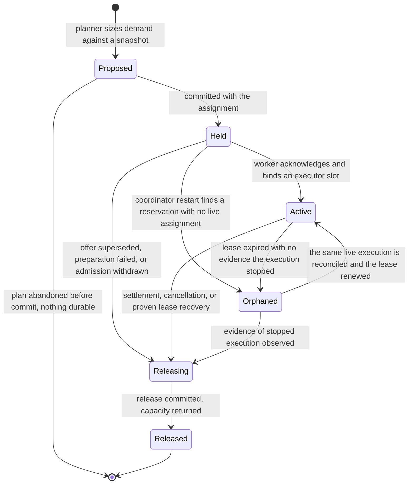
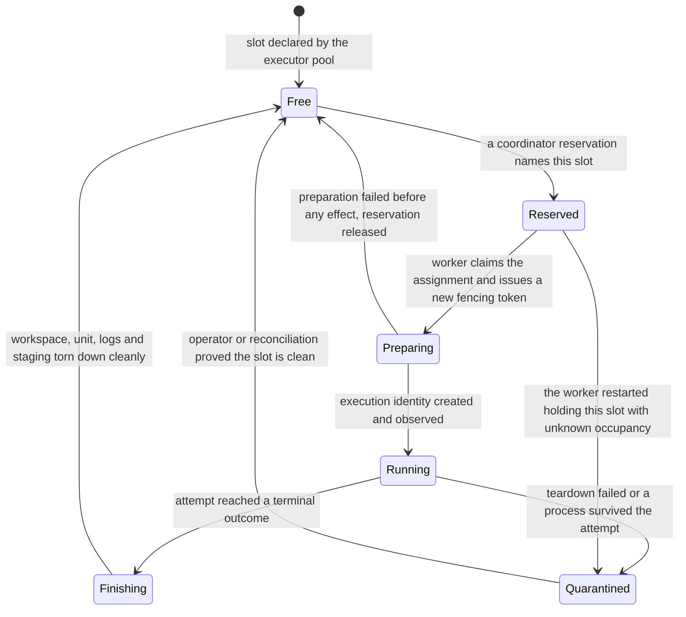

# S5b ADR: placement, resource demand and executor capacity

Status: accepted design. Implementation belongs to slice item two; live fleet evidence to the
Huyang-scale evidence batch that ends the campaign, not to the closeout plan's S7 matrix, which is
itself deferred. See [the scope classification](s5b-scope-classification.md).
Vocabulary: [CONTEXT.md](../../CONTEXT.md). Implemented primitives: [system model](system-model.md).

The closeout plan is a design inventory, not a mandate to build every mechanism. The campaign
optimizes for one proven use case, Huyang-scale backlog batches, so every capability here is
classified **implement now**, **seam only** or **deferred**; see [Classification](#classification).

## Scenario and decision

One coordinator plans work for one enrolled worker, an ordinary bundle names a host in
`Placement.Hosts`, and execution behaves as though a worker runs one attempt at a time. A backlog
batch breaks both assumptions: it wants several attempts at once, and compilation-heavy work on a
capable host without the submitter naming that host. Placement becomes a three-phase coordinator
function and host capacity becomes an explicit, durable, reservable resource. Both are built now.

1. **Hard-constraint filtering.** A worker is a candidate only if it satisfies every declared hard
   constraint: environment compatibility, OS and architecture, minimum CPU class, minimum CPU units
   and memory, device needs, credential capability, every required resource binding, and
   availability of the provider route the task needs. Failing one removes the worker and records the
   reason. Network zone and accelerator constraints share this shape but no fleet host declares them.
2. **Preference scoring.** Surviving candidates are ranked by CPU headroom, preferred CPU class,
   data locality and a warm immutable environment cache. Scoring never admits a worker that
   filtering rejected, and a preference never becomes a silent constraint. Queue depth, energy and
   cost policy and operator affinity are score components carried at zero weight.
3. **Reservation.** The highest-scoring candidate is bound by acquiring a `ResourceReservation`
   against the same snapshots scoring read, in the transaction that commits the assignment. If a
   snapshot is stale or the reservation cannot be acquired, placement fails and the entry returns to
   the queue with that reason. Work is never admitted on unverified capacity.

An ordinary task does not name a hostname. It declares capabilities, an execution profile, a
`ResourceDemand` and optional preferences, and the coordinator chooses the worker and records why. A
hostname stays a legitimate hard constraint only when locality is intrinsic: an approved existing
directory or dataset on one host, a required device or host-only service, or an action an operator
deliberately fences to one worker. Prefer a logical resource declaration resolving through the
operator catalog to approved worker/path bindings; the existing `directoryresource.Registration`
pair of worker, resource, path, revision and access is that mapping. One binding pins placement,
several leave the choice to the scheduler, writable bindings retain exclusive writer fencing, and
locality is never inferred from the submitting machine.

`domain.Placement` stays the submitter's declared constraint input on a `Task`, extended with the
remaining hard-constraint fields rather than replaced, immutable for its graph revision.
`ResourceDemand` is a new sibling field on the task definition, not a member of `Placement`, because
demand is sized independently of eligibility. `PlacementDecision` is the coordinator's output, the
durable record of evaluating one `Placement` and one `ResourceDemand` against a set of
`WorkerCapacitySnapshot` rows; a submitter can never author or mutate it. It is carried through
`AssignmentPlanItem` and committed with the `Assignment` it justifies, so an assignment and its
explanation share one transaction. `ProviderRoute` selection stays separate; `PlacementDecision`
records which route the chosen worker had to support, not how routes ranked.

## Frozen records, authority and lifetime

| Record | Bucket | Owner and sole permitted mutator | Durable commit point | What it is, its identity and its lifetime |
| --- | --- | --- | --- | --- |
| `ResourceDemand` | implement now | Submitter declares; only coordinator ingestion writes it, inside an immutable task definition | Workflow/graph-revision commit | Minimum and preferred CPU class, normalized CPU units to reserve, memory, scratch bytes, device needs, and the execution profile expanding to them. A build preset expands to minimum `medium` and preferred `high` unless overridden; a light preset may run on `low`. Identity: the owning task at its definition revision. Immutable for that graph revision, never rewritten to change execution history |
| `WorkerCapacitySnapshot` | implement now | Worker observes; only the coordinator snapshot-accept transaction admits a row, and accepted rows are never edited | Accepted worker snapshot store | One worker's observation of itself at an instant: allocatable CPU units, memory and scratch, free slots, CPU pressure and headroom, memory and disk headroom, active steward reservations, provider-session headroom and freshness. Identity: (worker ID, worker epoch, sequence). Immutable once accepted, expiring by freshness policy; planner and status read the same accepted rows |
| `ExecutorPool` | implement now | Coordinator catalog; only the catalog reload transaction | Catalog revision, projected to the worker | One worker's configured concurrency envelope: how many slots may exist and the allocatable totals they draw from. Identity: (worker ID, pool name, catalog revision). Lives for that revision; a shrink drains future admission and never revokes a running slot |
| `ExecutorSlot` | implement now | Worker owns occupancy through its journal; coordinator owns slot identity and the fencing token | Worker journal commit, then coordinator acceptance | One independently fenced execution position owning an isolated T3 identity, systemd unit, workspace, lease, log stream and artifact staging area. Identity: (worker ID, pool name, slot ordinal, fencing token), the token reissued on every acquisition so a stale holder cannot reuse a recycled ordinal. Lives from acquisition to clean release or quarantine |
| `ResourceReservation` | implement now | Coordinator; only its assignment/settlement transaction | Same transaction as its `Assignment` | A lease-bound commitment of allocatable capacity on one worker, carrying the assignment ID, bound slot, reserved CPU units, memory and scratch, and the lease token and expiry it follows. Identity: the reservation ID. Lives from assignment commit to exactly one release |
| `PlacementDecision` | implement now | Coordinator planner, written once at plan commit | Same transaction as its `Assignment` | The durable explanation of one placement, detailed under [How a placement is explained](#how-a-placement-is-explained). Identity: the assignment ID. Immutable, retained with the attempt's history |
| `QueueEntry` | seam only | Coordinator admission loop | Coordinator SQLite, revision-fenced | One admissible unit of work awaiting placement, normally one attempt, carrying enqueue time, priority class and the last placement failure reason. Identity: (attempt ID, queue generation). Lives from enqueue to a terminal queue state |
| `PriorityClass` | seam only | Operator policy; coordinator configuration reload | Catalog/policy revision | Bounded operator policy: a small named set with a fixed total order, onto which `Required task` and `Surplus task` map. Identity: the class name at a policy revision, which is its lifetime |
| `PreemptionRequest` | deferred | Coordinator, when built | not built | See [Classification](#classification) for the revisit trigger |

The two seam records are committed and readable but drive no mechanism: admission is arrival order
within a class, the class is recorded metadata, and a later ranking policy reuses admission unchanged.

## CPU class, allocatable capacity and current pressure are three separate facts

They have different owners, change rates and uses, and no component may substitute one for another.

- **CPU performance class** is a static ordinal capability floor the operator assigns to describe
  useful per-core and build performance. The initial mapping is normandy `low`, homelab `medium`,
  omarchy-pc `high`, and that mapping is a user decision. It is a hard-constraint and preference
  input, never live load. S5d may record a build benchmark and calibrated normalized capacity, but a
  transient benchmark never silently changes the configured class; that is an operator action.
- **Allocatable capacity** is the operator-configured total the scheduler may commit: CPU units,
  memory, scratch and executor slots. It changes only by catalog revision, and reservations are
  subtracted from it.
- **Current pressure** is the worker's live observation: CPU pressure, memory and disk headroom,
  free slots and freshness. Linux pressure information may supplement load; raw load average alone
  is never the resource model. Pressure feeds preference scoring and staleness checks; it never
  redefines the class and never raises allocatable capacity.

Work that does not need high performance should prefer a suitable lower-class worker when that
preserves high-class headroom for demanding work.

## Executor capacity and provider concurrency are separate limits

An `ExecutorPool` bounds how many attempts a worker executes at once. Provider-session concurrency
bounds how many sessions a provider route or quota bucket permits at once. They are measured on
different axes, enforced at different points, and neither is derived from the other. An attempt
starts only when it holds **both** a free `ExecutorSlot` with its `ResourceReservation` and provider
admission for its route. A full executor pool does not mean quota is exhausted, and an exhausted
quota bucket does not mean the worker is busy.

Concurrent attempts on one worker have isolated T3 identities, systemd units, workspaces, leases,
logs and artifact staging areas; nothing is shared implicitly between slots. Preflight and bounded
read-only context collection reserve executor and CPU capacity but never provider quota, because
they open no provider session; provider reservation happens when the session is about to open. The
qualification target stays two concurrent light attempts on normandy, four mixed on homelab, and
eight light plus concurrent build work on omarchy-pc: tested floors, not configured ceilings. Live
evidence deferred to the evidence batch.

## State machines

Reservation lifecycle. `Releasing` makes release a committed transition rather than an inference; a
second release of a `Released` reservation is an idempotent no-op returning the original receipt.
`Orphaned` is recovery-required and deliberately holds capacity, because returning it without
evidence admits work beside an execution that may still be running.

Executor-slot lifecycle. A quarantined slot is not allocatable capacity, `Free` is the only state a
reservation may bind, and the token issued in `Preparing` invalidates any earlier holder of that
ordinal.

The queue lifecycle stays deliberately small: `Pending` until dependencies are verified and any
schedule time is reached, `Queued` while awaiting placement, `Placing` during evaluation, `Admitted`
when an assignment and reservation commit, and the terminal states `Withdrawn` (cancellation or
upstream failure), `Expired` (task expiry passed) and `Rejected` (no worker can satisfy the hard
constraints under the current catalog). A failed placement returns the entry to `Queued` with its
reason; blocking on capacity or quota is not terminal. No aging, promotion or preemption transition
exists, and adding one must not require new queue states.

## Invariants

1. Placement filters hard constraints before scoring preferences, and a preference can never admit a
   worker that filtering rejected.
2. An assignment and its `ResourceReservation` commit in one transaction; no window exists in which
   an assignment has no reservation.
3. **Exactly-once release.** Every reservation is released exactly once, on exactly one of these
   terminal paths: successful settlement; failed settlement; cancellation after effect containment;
   failed preparation before execution; withdrawal of an offered assignment that never dispatched;
   worker drain rejection of an unclaimed offer; and lease recovery with evidence that execution
   stopped. Release is keyed by reservation ID and is idempotent; a repeated release is a no-op, and
   a release without a committed state transition is not a release. Deferred preemption, when built,
   terminates through this same release and adds no new path.
4. Stale capacity cannot admit work: a snapshot past its freshness bound or from a superseded worker
   epoch or sequence is not a placement input, and a reservation acquired against a since-superseded
   snapshot fails its commit.
5. Executor capacity and provider-session concurrency are enforced separately, and an attempt starts
   only when it holds both.
6. Static CPU class is a capability floor and never live load; allocatable capacity changes only by
   catalog revision; pressure never raises allocatable capacity.
7. A task naming no host stays portable across every eligible worker, and no placement input is
   derived from the submitting machine.
8. A required resource binding resolving to exactly one worker pins placement; if it is unavailable
   the entry blocks with that reason and never silently relocates.
9. Preflight and context collection reserve executor and CPU capacity and never provider quota.
10. Every placement is explainable from durable state alone.

## How a placement is explained

S5d's gate requires a placement trace, so the explanation is durable state, not a log line. For every
committed assignment, `PlacementDecision` retains the candidate worker set evaluated, each rejected
worker with the first constraint that rejected it, the preference score and its named components per
surviving candidate, the identities (worker, epoch, sequence, observation time) of the snapshots
read, the reservation acquired with its sized resources, and the selected worker. A failed placement
records the same rejection reasons on the `QueueEntry`, so "why is this still queued" and "why did
this land here" share one evidence set that survives coordinator restart and is exposed through the
diagnostic view.

## Failure and recovery

| Situation | Detected by | Who acts | Evidence required | Must never happen |
| --- | --- | --- | --- | --- |
| Coordinator restart with reservations outstanding | Startup reconciliation over reservation, assignment and attempt rows | Coordinator | Committed reservation rows joined to live assignments and current worker snapshots | Capacity silently returned, or an assignment resurrected without its reservation |
| Worker restart with slots occupied | Worker journal replay against the coordinator's slot records | Worker reports, coordinator accepts | Journal entries for each occupied slot and the observed state of its execution identity | A recycled slot ordinal reused under an old fencing token |
| Stale or missing capacity snapshot | Freshness and epoch/sequence check in the admission loop | Coordinator | A snapshot within its freshness bound from the current worker epoch | Admission against an absent, expired or superseded snapshot |
| Double release of a reservation | Idempotent release keyed by reservation ID | Coordinator | The committed `Released` transition and its receipt | Capacity counted back twice, or an over-admission caused by it |
| Lease expiry while a slot is held | Lease expiry check plus worker observation | Coordinator decides, worker supplies observation | Positive evidence the execution stopped, or reconciliation of the same live execution | Treating expiry alone as proof of a free slot, or creating a replacement execution beside a live one |

## Alternatives and failures

Deriving executor concurrency from provider concurrency was rejected: it couples an unrelated
provider limit to host capacity and idles a capable worker whenever a quota bucket narrows. Letting a
submitter name a host by default was rejected: it hides locality inside task definitions, makes
workflows unportable and produces placements no trace can explain. Inferring capacity from load
average alone was rejected: load does not distinguish class, ignores committed reservations and
cannot be reserved against. Releasing capacity on lease expiry was rejected: expiry is a timeout, not
evidence a process stopped. A free-form numeric priority field was rejected even as a seam, because
it would have to be honoured before any policy exists.

## Live evidence deferred to the evidence batch

These need multiple live hosts, real provider interaction, restarts or saturation on real hardware.
Live evidence deferred to the evidence batch.

- The 2/4/8 concurrency qualification floors with isolated attempt state on the three workers.
- Coordinator restart with reservations outstanding, and worker restart with slots occupied.
- Exactly-once release across every enumerated terminal path under real settlement and recovery.
- CPU-heavy work avoiding normandy in practice, and homelab or omarchy-pc accepting a portable
  workflow without coordinator-local paths.
- Stale-snapshot rejection under a real worker epoch change and a real drain.

## Classification

| Capability | Bucket | Note or revisit trigger |
| --- | --- | --- |
| Hard-constraint filtering, then preference scoring, then reservation | implement now | Slice item two |
| Capability and CPU-class placement (`ResourceDemand`, class floor and preference) | implement now | Slice item two |
| Separation of CPU class, allocatable capacity and current pressure | implement now | Stops load being read as capability |
| `WorkerCapacitySnapshot` with freshness, epoch and sequence identity | implement now | Stale capacity must not admit work |
| `ExecutorPool` and independently fenced `ExecutorSlot` records | implement now | Higher executor concurrency, 2/4/8 floors |
| Executor capacity kept separate from provider-session concurrency | implement now | Both held before an attempt starts |
| Atomic `ResourceReservation` with exactly-once release | implement now | Paths enumerated in invariant 3 |
| `PlacementDecision` and the durable placement trace | implement now | Required by the S5d gate |
| Resource-binding locality, host as an explicit hard constraint | implement now | Uses the existing directory-resource catalog |
| Network zone and accelerator hard constraints | seam only | Evaluated with the other constraints; no fleet host declares them |
| Queue depth, energy/cost and operator-affinity preferences | seam only | Score components at zero weight; revisit when worker cost differs materially |
| `QueueEntry` lifecycle and recorded `PriorityClass` | seam only | Arrival order within a class; shape admits a later policy without reworking admission |
| Queue aging and anti-starvation promotion | deferred | Revisit when a batch is observed passing over an admissible entry for longer than one batch window |
| Priority policy engine and deadline-driven admission | deferred | Revisit when required work misses a declared deadline that headroom could have met |
| `PreemptionRequest`, safe-boundary preemption, checkpoint-coupled interruption | deferred | Revisit when a high-value task must displace running work rather than wait for a slot; must reuse the existing release path |
